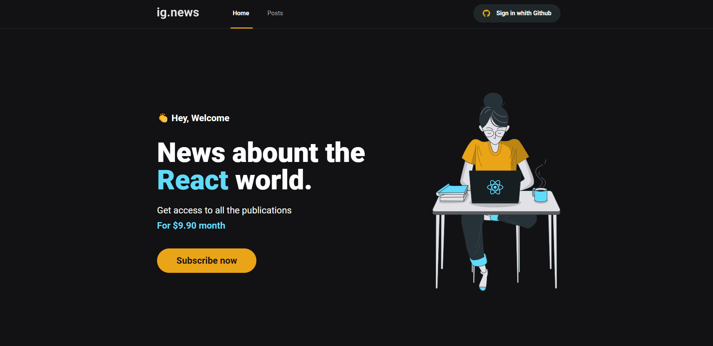

<h1 align="center">
  
</h1>



<h1 align="center">
    ig.news - Next.js
</h1>
<p align="center">Project create during the React Ignite 🚀</p>


## About this project

The project aims to study and develop an application in ReactJS with NextJS for post listing and subscription system.

The application was developed using the NextJS framework applying concepts such as external API consumption, Root API, Server Side Rendering (SSR), Static Site Generation (SSG), STRIPE for subscription payments, NextAuth for authentication with Github, FaunaDB to store information database and Prismic CMS for adding and managing post content.

This project was developed during the chapter 03 from the [Ignite course](https://rocketseat.com.br/)

Figma Link 🎨
- [Ignews Figma](https://www.figma.com/file/gl0fHkQgvaUfXNjuwGtDDs/ig.news)

---

## Technologies 👩‍💻

Thecnologies used in this project

- [ReactJS](https://reactjs.org/)
- [NextJS](https://nextjs.org/)
- [TypeScript](https://www.typescriptlang.org/)
- [SASS](https://sass-lang.com/)
- [Next-Auth](https://next-auth.js.org/)
- [Stripe](https://stripe.com/)
- [FaunaDB](https://fauna.com/)
- [Prismic CMS](https://prismic.io/)

---

## Requirements

It is necessary to have installed on your machine

- [Git](https://git-scm.com/)
- [Yarn](https://classic.yarnpkg.com)
- [Stripe CLI](https://stripe.com/docs/stripe-cli)

Create accounts in this external services:

- [Stripe](https://stripe.com/)
- [FaunaDB](https://fauna.com/)
- [Prismic CMS](https://prismic.io/)


## Starting 🚀

```bash
# Clone this project
$ git clone https://github.com/Artur-Ceschin/ignews.git

# Access
$ cd ignews

# Install dependencies
$ yarn

# Execute stripe on your terminal
$ stripe listen --forward-to localhost:3000/api/webhooks 

# Run the project
$ yarn dev

# The server will initialize in the <http://localhost:3000>
```

---

## Licença

Distribuído sob a licença MIT. Veja [LICENSE](LICENSE) para mais informações.

---

## License📃

This project is under license from MIT. For more details, see the [LICENSE](./LICENSE.md) file.

### Author
---

Made with ❤️ by Artur Ceschin 👋🏽 Please fell free to contact me!
<br/>
[](https://www.linkedin.com/in/artur-peres-ceschin-programador/) 
[](mailto:artur.ceschin@gmail.com)